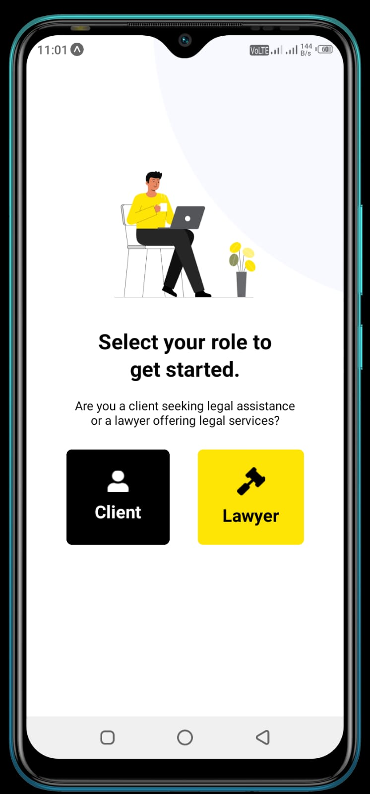
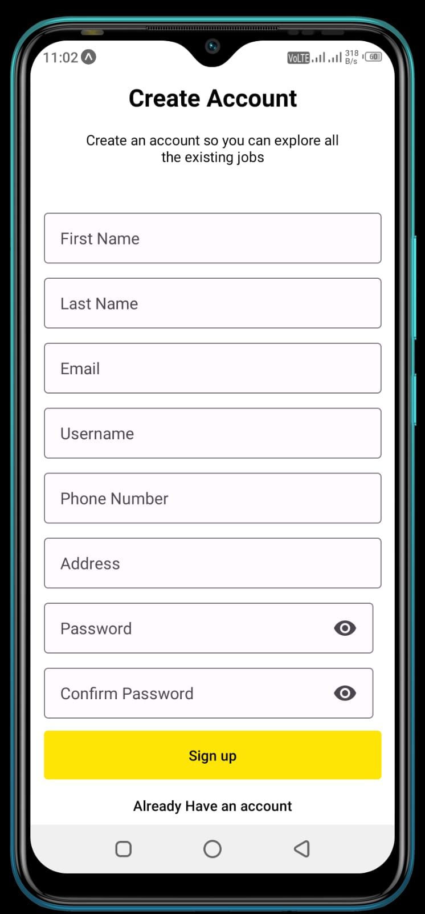
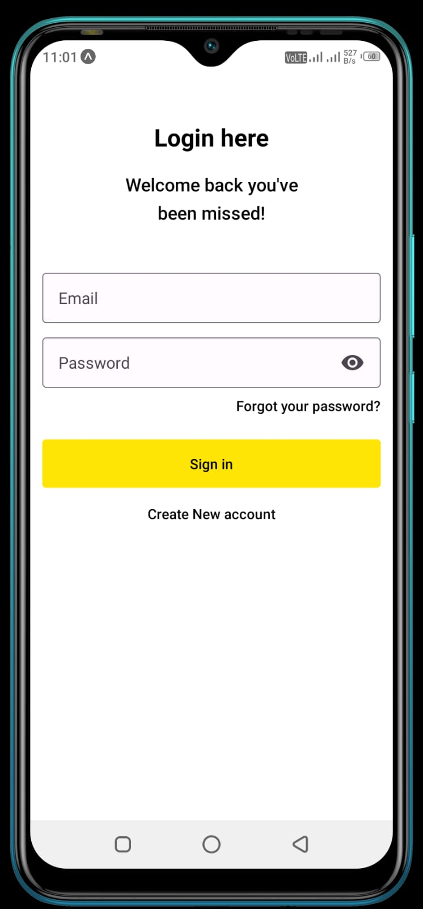
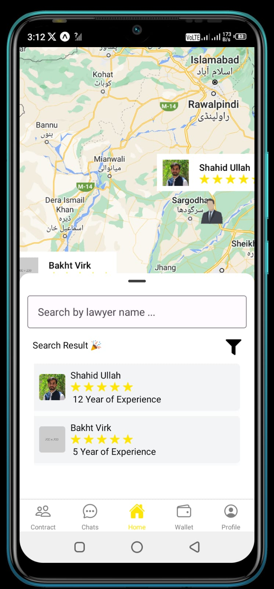
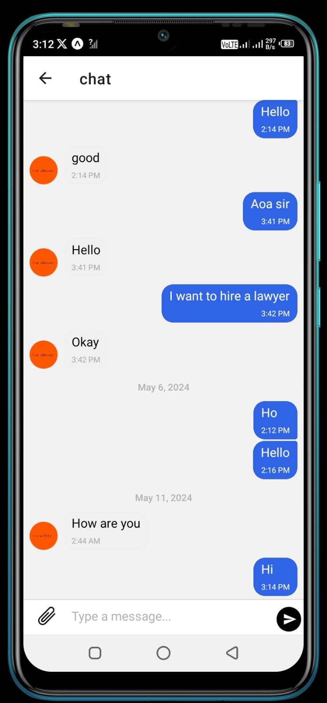
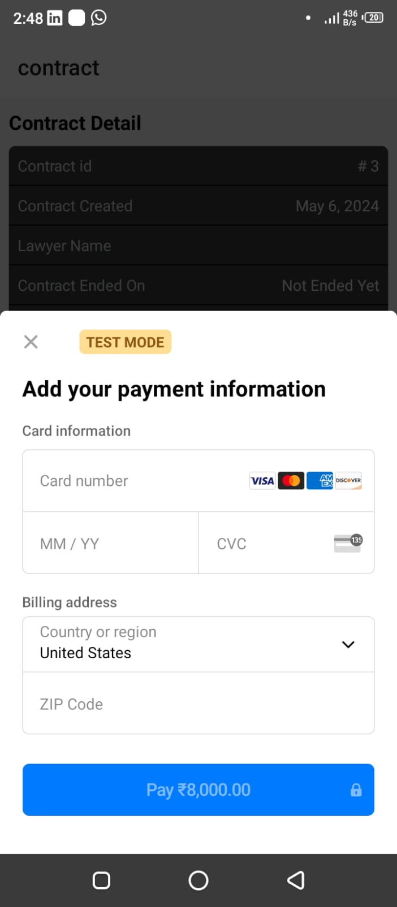
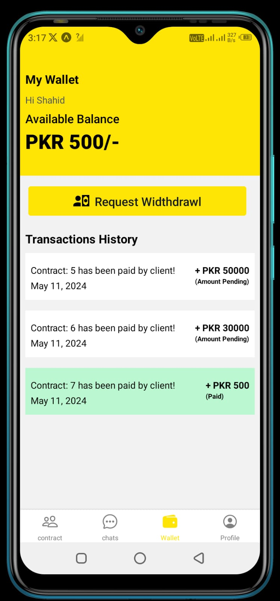

# Lawpeer

Lawpeer is a mobile application designed to connect clients with lawyers, facilitating contract creation, real-time chat, secure payments, and lawyer search via geolocation. This app aims to revolutionize the accessibility and efficiency of legal services.

## Features

- **Client-Lawyer Interaction**: Easily connect with legal professionals.
- **Roles and Permissions**: Lawyers can create contracts, while clients can view and sign them.
- **Contract Management**: Both clients and lawyers can manage and view their contracts.
- **Real-time Chat**: Communicate instantly with your lawyer using Socket.IO.
- **Stripe Integration**: Secure and seamless in-app payment processing.
- **Google Maps Integration**: Embedded within the home page to find lawyers nearby.
- **Advanced Search and Filters**: Clients can search for lawyers by name, skills, experience, rating, and city.
- **eWallet**: Manage funds for legal services within the app.
- **Complaints and Reports**: Users can file complaints or report issues related to contracts.
- **Update and Manage Profile**: Users can update and manage their profiles.
- **Admin Panel**: Website-based admin panel for managing users, contracts, and overall platform.

## Screenshots

*Select Role Screen: Register as a Laywer or Client.*


*register Screen: Manage your funds for legal services.*


*Login Screen: Manage your funds for legal services.*


*Home Screen: View available lawyers and search using filters.*


*Chat Screen: Real-time communication with your lawyer.*


*Payment Screen: Securely pay for services via Stripe.*


*Contract Screen: View and manage created and assigned contracts.*


*eWallet Screen: Manage your funds for legal services.*

## Installation

1. Clone the repository:
    ```bash
    git clone https://github.com/rehan22113/Lawpeer--A-Mobile-Application
    ```

2. Navigate to the project directory:
    ```bash
    cd lawpeer
    ```

3. Install dependencies:
    ```bash
    npm install
    ```

4. Run the application:
    ```bash
    npm start
    ```

## Usage

1. **Sign Up/Log In**: Create an account or log in to access features.
2. **Find a Lawyer**: Use the map or search functionality with filters to find a lawyer near you.
3. **Create a Contract**: (Lawyer role) Start a new contract with your client.
4. **View and Sign Contract**: (Client role) Review and sign contracts created by your lawyer.
5. **Chat**: Communicate with your lawyer in real-time using Socket.IO.
6. **Manage Contracts**: View and manage your created and assigned contracts.
7. **Make a Payment**: Use the secure Stripe integration to pay for legal services.
8. **eWallet**: Manage funds for legal services within the app.
9. **Complaints and Reports**: File complaints or report issues related to contracts.
10. **Update and Manage Profile**: Users can update and manage their profiles.
11. **Admin Panel**: Website-based admin panel for managing users, contracts, and the overall platform.

## Technologies Used

- **Frontend**: React Native
- **Backend**: Python FastAPI
- **Database**: PostgreSQL
- **Payment Processing**: Stripe API
- **Geolocation**: Google Maps API
- **Real-time Chat**: Socket.IO

## Contributing

Contributions are welcome! Please fork the repository and submit a pull request with your changes. For major changes, please open an issue to discuss what you would like to change.

## License

This project is licensed under the MIT License. See the [LICENSE](LICENSE) file for details.

## Contact

For any inquiries or feedback, please reach out to [raorehanweb@gmail.com](mailto:yourname@domain.com).
